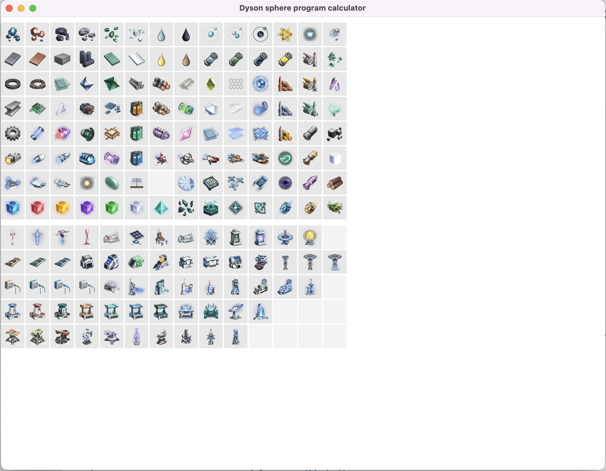
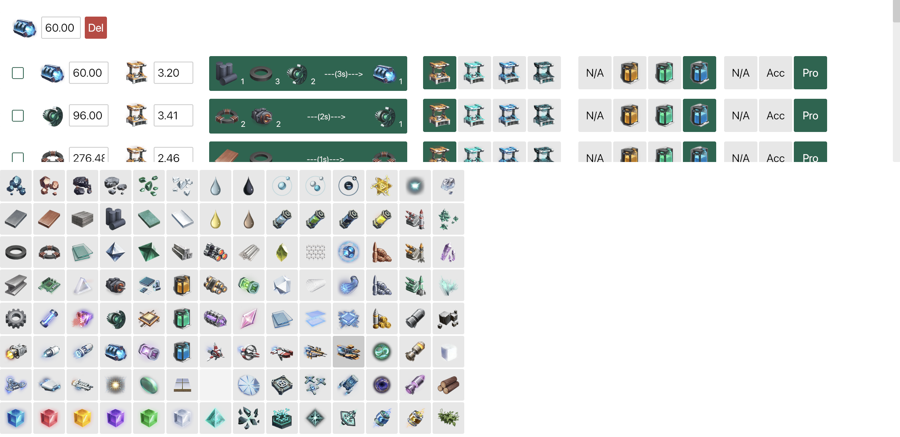

# dsp-calculator

**Desktop** Dyson Sphere Program calculator

**⚠️⚠️Currently, this project is only in demo version. Most features have not been implemented yet.⚠️⚠️**

## Usage

Execute `cargo run` in the root directory of the project to run the program. Click on any item icon to calculate its production chain.

After clicking the icon of super-magnetic ring, the corresponding production chain will be displayed. The target production rate can be edited in the input box. The checkbox can be used to exclude certain items from the production chain.

## Features

* Calculate the production chain of any item (or multiple items) in the game.
* Scale the production chain.
* Selectively exclude items from the production chain.
* Calculate the proliferator usage.

## Roadmap

* **Optimize UI**
    * Optimize item selector
    * Optimize production chain display (title, etc.)
    * Add input panel to choose target item and its production rate
    * Optimize internal widget styles
* Add item flow diagram
* Support export and load production chain from file
* Add global recipe config toggle for all steps
* Add CI workflow to publish executables

## Known issues

* Calculation of `1 Coal + 2 Crude Oil => 3 Refined Oil` is not correct.
* Occasionally, when the production chain involves both `Hydrogen` and `Refined Oil`, the calculation may be stuck due to the circular dependency.
* When by-products exists, the calculation may be incorrect.

If you find any undesired behavior, feel free to open an issue.

## Contribution

Since this project is still in the early stage, any contribution is welcome.

## Acknowledgements

* This project is inspired by [dsp-calc](https://github.com/DSPCalculator/dsp-calc/) project. This project also uses the icons from the same project.

## License

MIT License
